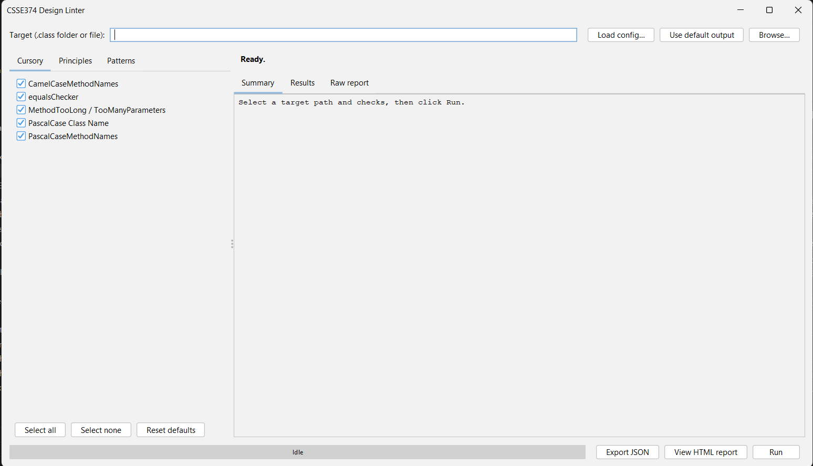
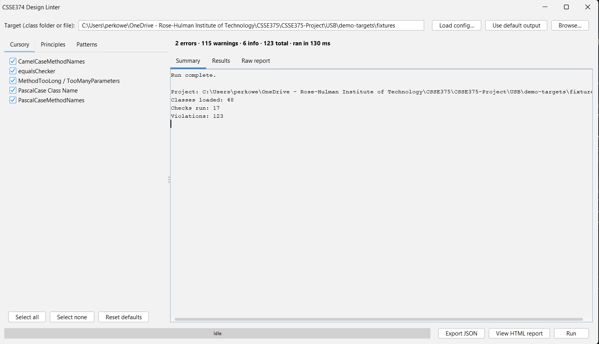
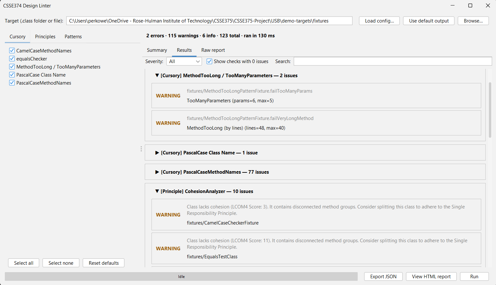
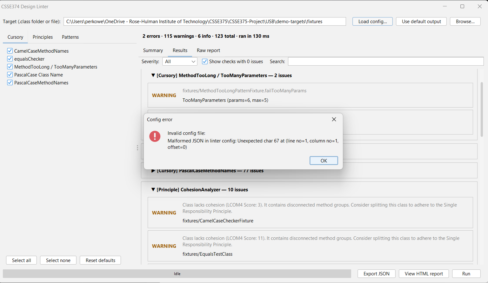
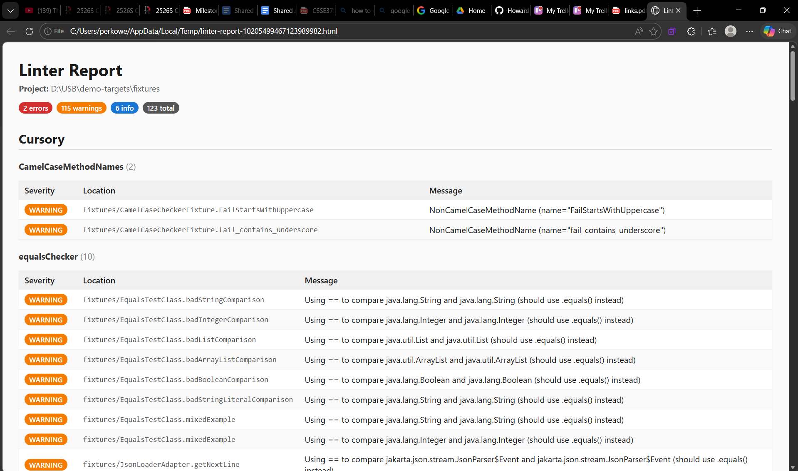
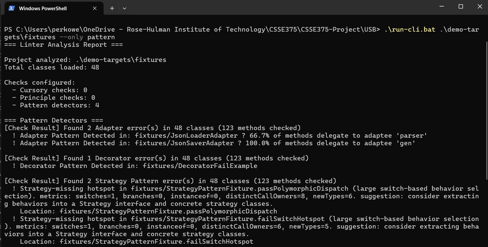

# User Guide
**Java Design Linter** · CSSE 375 · Ervin Perkowski · May 2026

This guide is for end users of the linter. If you're installing the
linter for the first time, start with the
[Installation Guide](installation-guide.md). If you just want a quick
demo, read the [Getting Started](getting-started.md) one-pager.

---

## 1. What the linter does

The linter inspects **compiled Java bytecode** (`.class` files) and
reports:

- **Cursory smells** — surface-level issues like naming, missing
  `equals`/`hashCode`, methods that are too long.
- **Principle violations** — Single Responsibility, Open/Closed,
  Interface Segregation, Hollywood, Cohesion, Principle of Least
  Knowledge.
- **Design pattern detection** — places where common patterns
  (Template Method, Strategy, Decorator, Adapter) are present or
  almost-present.

It does **not**:
- Read source `.java` files (only bytecode)
- Auto-fix anything
- Compile your code

---

## 2. The GUI


*Figure 1 — Linter GUI just after launch.*

### 2.1 Layout

```
+-------------------------------------------------------------+
| Target: [ path/to/classes              ] [Browse…] [Default]| ← target bar
|                                                  [Load cfg…]|
+-------------------------------------------------------------+
|              |   1 error · 2 warnings · 0 info · 3 total   | ← summary banner
|              |   · ran in 0.45 s                            |
|  Cursory     +---------------+--------------+--------------+
|  Principles  |   Summary     |   Results    |  Raw report  |
|  Patterns    +---------------+--------------+--------------+
|              | (severity / search filter bar)              |
|              |                                              |
|  [ Select    |  ▼ Cursory · EqualsChecker (1)               |
|    all  ]    |      ERROR  com.example.Foo                  |
|  [ Select    |  ▶ Pattern · MethodTooLong (2)               |
|    none ]    |                                              |
|  [ Reset ]   |                                              |
+--------------+----------------------------------------------+
| ████████████████ 60%                            [Run]       | ← progress + run
+-------------------------------------------------------------+
```


*Figure 2 — Post-run state with severity counts and run duration in the banner.*

### 2.2 Basic workflow

1. **Pick a target.** Either:
   - Click **Browse…** and pick a folder of `.class` files (or a
     single `.class`), OR
   - Click **Use default output** (the linter looks for `target/classes`,
     `out`, `build/classes` next to your current working directory).
2. **(Optional) Adjust which checks run.** The left pane has three
   tabs (Cursory, Principles, Patterns). Untick anything you don't
   want, or click **Select all** / **Select none** / **Reset defaults**.
3. **Click Run.** The progress bar shows activity; the right pane
   updates when finished.
4. **Read the results.** The summary banner at the top gives the
   one-line breakdown. The **Results** tab is grouped by check and
   collapsible. The **Raw report** tab has the full text the CLI
   would produce.

### 2.3 Filtering results

The Results tab has a filter bar:

- **Severity** dropdown: All / ERROR / WARNING / INFO.
- **Search** box: substring matched against both message and location.
- **Show checks with 0 issues** toggle: hide quiet groups.

Filtering is interactive — typing in Search updates the display
immediately. Empty search and "All" severity is the unfiltered state.


*Figure 3 — Results tab with a check group expanded to show individual violations.*

### 2.4 Loading a JSON config

Click **Load config…** and pick a JSON file. The selected checks
update to match `enabled` flags in the file. Schema:

```json
{
  "defaultEnabled": true,
  "checks": {
    "EqualsChecker":        { "enabled": false },
    "MethodTooLongPattern": { "enabled": true, "options": { "threshold": "20" } }
  }
}
```

Keys can be either the **simple class name** (`EqualsChecker`) or the
**fully qualified** name. Missing keys inherit `defaultEnabled` (which
itself defaults to `true`). If the file is malformed, an error dialog
explains what went wrong and the current selection is unchanged.


*Figure 4 — Bounded, user-meaningful error dialog when a malformed JSON config is loaded.*

### 2.5 Exporting JSON

After a run, click **Export JSON** in the bottom bar. A file chooser
picks the destination. The exported JSON contains the project path,
total violation count, and a list of every violation with location and
severity.

### 2.6 Viewing the HTML report

After a run, click **View HTML report** in the bottom bar. The
linter writes a self-contained HTML page to an OS temp file and
opens it in your default browser. No file dialog — one click and
the report is on screen.

The page contains:

- A header with the project path
- Summary badges: `N errors`, `N warnings`, `N info`, `N total`
- Per-category sections (Cursory, Principle, Pattern)
- Per-check tables of violations with colored severity badges,
  location, and message

The page is fully self-contained — inline CSS, no external assets,
no JavaScript — so you can save the file and email it, drop it on
a network share, or open it offline.


*Figure 6 — HTML report rendered in the user's default browser after clicking "View HTML report". Self-contained: inline CSS, no JavaScript, no external assets.*

---

## 3. The CLI


*Figure 5 — Headless CLI output: violations printed to stdout, followed by the exit code.*

For headless / CI use:

```
java -cp linter.jar rhit.csse.csse374.linter.presentation.LinterCLI \
    <path> [--only cursory,principle,pattern,all] [--config file.json] [--help]
```

### 3.1 Common invocations

| What you want | Command |
|---|---|
| Lint everything in `target/classes` | `LinterCLI target/classes` |
| Only patterns | `LinterCLI target/classes --only pattern` |
| Only cursory + pattern | `LinterCLI target/classes --only cursory,pattern` |
| Use a config file | `LinterCLI target/classes --config rules.json` |
| Show help | `LinterCLI --help` |

### 3.2 Exit codes (for CI)

| Code | Meaning |
|---|---|
| 0 | Clean — no violations |
| 1 | Violations found |
| 2 | Usage error (missing args, bad flags, unreadable config) |
| 3 | Runtime error |

A typical CI gate: `LinterCLI target/classes && echo "clean" || echo "violations"`.

---

## 4. Errors you might see

| Where | Message | What it means | What to do |
|---|---|---|---|
| GUI | "Missing target" | Path field empty or doesn't exist | Pick a real path |
| GUI | "No checks selected" | All checkboxes off | Tick at least one check |
| GUI | "Invalid config file" | JSON didn't parse | See message detail; fix syntax |
| GUI | "Could not read config file" | File missing or unreadable | Check the path |
| GUI | "Run failed" | Pipeline threw | See message; usually corrupt classfile in target |
| CLI | "Unknown category" | Bad value for `--only` | Use `cursory`, `principle`, `pattern`, or `all` |
| CLI | "--only requires a comma-separated list" | `--only` with no value | Add the value |
| CLI | "--config requires a path" | `--config` with no value | Add the path |
| CLI | "Invalid config file" | Same as GUI | Check JSON syntax |
| CLI | "Linter failed: …" | Pipeline threw | Usually corrupt classfile; see message |
| CLI | "Warning: Path does not exist" | Bogus target | Use a real path |

---

## 5. Tips

- **Faster runs:** narrow with `--only`. Patterns are the slowest
  family on the linter's own bytecode (~5% of total time).
- **Config + CLI in CI:** check in a `linter.json` file with the
  project's house rules and invoke `LinterCLI --config linter.json`.
  Exit code 1 fails the build on violations.
- **Inspecting a single file:** point the linter at a single `.class`
  file, not a directory.
- **Re-running with different checks:** the selected check list is
  remembered for the session but resets each time you launch.

---

## 6. Where to get help

- Quick start: [Getting Started](getting-started.md)
- Installing or setting up Java: [Installation Guide](installation-guide.md)
- Extending or maintaining the linter: [Developer Guide](developer-maintenance-guide.md)
- Bug reports: open an issue on the project repository
